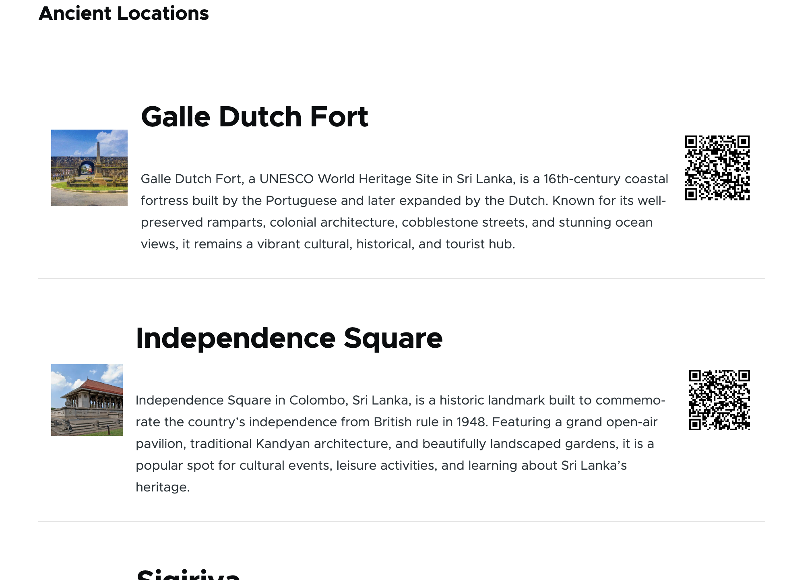

# Ancient-Location_QRCode_Module_Drupal-10-11

A **custom Drupal 10/11 module** that generates and displays QR codes for ancient tourist locations in Sri Lanka. Scanning the QR code shows the official map/location URL or the node page itself.  

📦 **Module Name:** `ancient_location_qr`  
🛠️ **Core Compatibility:** Drupal 10 / 11  
🔗 **3rd-party Library:** [endroid/qr-code](https://github.com/endroid/qr-code) `^4.0`  
---
## **Purpose**

This module is designed to demonstrate **real-world Drupal 10/11 custom development** skills while building a useful feature:  
> Generate and display QR codes for ancient places. Visitors can scan the QR to quickly open a map or location details on their devices.
---
## **Skills Demonstrated**

- ✅ Custom module architecture (`.info.yml`, services, templates, libraries)  
- ✅ Using **Composer** for third-party PHP library integration in Drupal  
- ✅ Custom **Views Format plugin** (grid layout for Image | Title | QR)  
- ✅ Custom **Field Formatter** (turn map URL into QR image)  
- ✅ Custom **Block** plugin for standalone QR display  
- ✅ **Symfony Service** architecture with Dependency Injection  
- ✅ Drupal **caching best practices** (tags, contexts, lazy image generation)  
- ✅ Real-world utility: integrates with Views, blocks, and fields  
---
## **Key Features**

- **Generate QR codes** for node URL or map URL using [endroid/qr-code](https://github.com/endroid/qr-code)
- **Multiple display options**:
  - 📦 As a **Block**: place anywhere via Block Layout
  - 🎨 As a **Field Formatter**: attach to fields like `field_map_url`
  - 📐 As a **Custom Views Format plugin**: display a list of ancient places with Image | Title | QR layout
- **Admin settings (planned)**:
  - Image format: **PNG or SVG**
  - QR size (default: 250×250)
  - Optional **download QR code** link for users
- **Cache-friendly rendering** for performance
---
## **Screenshots**

### 1. View Block (Ancient Places view block)

---
## **Installation**

1. **Download or clone the module** into `web/modules/custom/ancient_location_qr`
   ```bash
   composer require endroid/qr-code:^4.0
